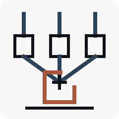
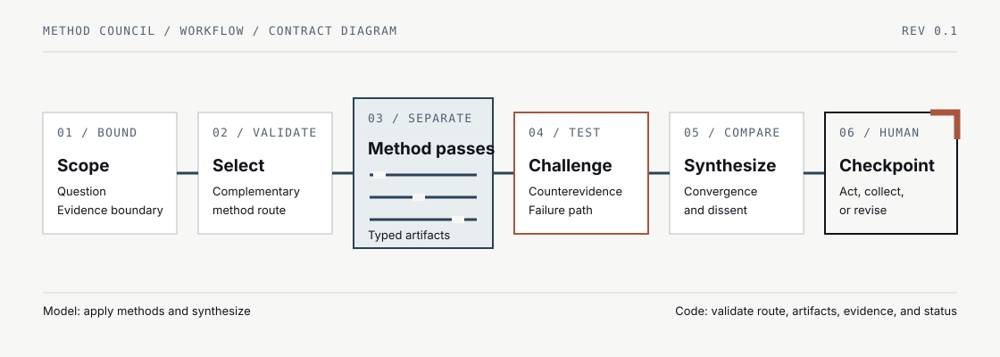
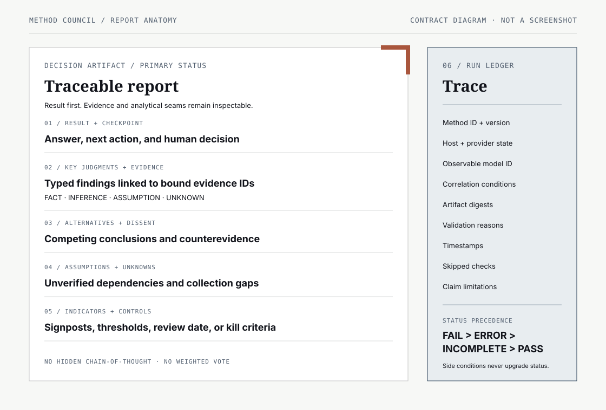

<p align="center">
  
</p>

<h1 align="center">Method Council</h1>

<p align="center">
  <strong>Structured methods. Separate analysis passes. One traceable report.</strong>
  <br>
  A provider-neutral methodology protocol with a Codex-subscription-first path.
</p>

> **Private pre-public candidate — not public alpha.** Four hardened,
> commit-bound Codex subscription runs now pass deterministic run and host-evidence
> verification. Every result remains honestly `INCOMPLETE / CORRELATED`. Claude
> and Gemini remain disabled preview adapters, and no GitHub remote or release
> exists.


## What this is

Method Council applies documented analytical methods to a question in separate,
inspectable passes. It then preserves their evidence, assumptions, unknowns, and
disagreements in a report that a human can review.

The members are methods, not simulated people. A route might combine a key
assumptions check, evidence-quality assessment, and analysis of competing
hypotheses because those procedures contribute different checks—not because
fictional experts were assigned different personalities.

The intended first host is Codex used through an existing ChatGPT subscription.
The canonical method and report contracts remain host-neutral so other model
providers can be added later as separately tested adapters.



## Why methods instead of personas

- **Inspect the procedure.** Each method records its source basis, adaptation,
  applicability, steps, failure modes, rigor variants, and claim limits.
- **Keep disagreement useful.** Synthesis reports convergence, divergence, and
  the evidence that could resolve a split. It does not manufacture consensus.
- **Separate kinds of diversity.** Method, model, provider, and source diversity
  are different claims. Same-model passes are labelled correlated.
- **Fail visibly.** Invalid, missing, failed, or simulated output cannot count as
  a successful method pass.
- **Keep hard gates in code.** Deterministic validation owns route limits,
  schemas, evidence binding, status precedence, and release eligibility.

## Run it in Codex

The repo includes a checked-in project skill at
`.agents/skills/method-council`. After installing the locked development
environment, open Codex from the repository and ask it to use the skill:

```bash
uv sync --frozen --all-groups
uv run --frozen method-council validate
uv run --frozen python scripts/sync_codex_skill.py check
```

```text
Use $method-council to assess whether we should adopt this architecture.
Use standard rigor, keep unknowns explicit, and do not make external calls.
```

The verified workflow is:

1. Scope the question, decision owner, constraints, and evidence boundary.
2. Propose a complementary set of methods for the activity and rigor level.
3. Validate that route before any method pass starts.
4. Run method passes separately, using bounded Codex subagents where available.
5. Validate each structured artifact and retain failure or correlation states.
6. Challenge the emerging answer, synthesize without voting, and stop at a
   human checkpoint.

The acceptance runner uses the existing ChatGPT-authenticated Codex CLI without
a separate provider API key. It executes from a tracked-file snapshot of an
exact source commit, rejects tracked-source mutation, and copies out only
allowlisted artifacts. Four hardened bundles are recorded. They prove the
bounded local path and internal consistency of those executions, not method
quality, general security, or cryptographic execution authenticity. See the
[Codex workflow](docs/CODEX_WORKFLOW.md),
[acceptance evidence](docs/ACCEPTANCE.md), and
[architecture](docs/ARCHITECTURE.md).

## Report contract

The report leads with the decision-relevant result and preserves the reasoning
artifacts needed to inspect it:

1. Result, next action, and checkpoint.
2. Key judgments linked to evidence and calibrated confidence language.
3. Alternatives, dissent, and counterevidence.
4. Assumptions, unknowns, and collection gaps.
5. Indicators, signposts, or kill criteria when the activity requires them.
6. Method, provider, correlation, validation, and limitation ledger.

Findings are typed as `fact`, `inference`, `assumption`, or `unknown`. Weighted
votes are not part of the contract. Schema-valid output is necessary but does
not prove that a method was applied faithfully or that a conclusion is sound.



Read the [report anatomy](docs/REPORT_ANATOMY.md) and
[canonical contracts](docs/CONTRACTS.md) for the detailed boundary.

## Current status

This repository remains at **Stage 0 — Private Build** because the local
implementation has not been attached to or read back from a GitHub remote. The
source is now a local pre-public candidate awaiting the remaining gates before
any visibility change.

Current foundations include:

- host-neutral schemas and architecture decisions;
- initial source-backed method records;
- a deterministic Python core with fail-closed route, evidence, aggregation,
  run, and release checks;
- a canonical Codex skill plus a content-bound repo-local projection;
- a commit-bound, snapshot-isolated Codex acceptance runner and unsigned local
  host-evidence verifier;
- disabled-by-default Claude and Gemini preview adapter contracts;
- four ChatGPT-authenticated, commit-bound Codex acceptance bundles that pass
  run and host-evidence verification while retaining `INCOMPLETE / CORRELATED`;
- Apache-2.0 licensing and clean-room notices;
- original code-native diagrams, social preview, and generated workbench hero.

Not yet established:

- independent method-fidelity, security, and usability review;
- independently signed or host-controlled execution attestation;
- validated compatibility with any non-Codex provider;
- public-alpha release eligibility;
- a GitHub remote, release, support channel, or public vulnerability channel.

No remote repository or public release is implied by this local source tree.

## Local development

The repository targets Python 3.12 and `uv`. These are the canonical local
development checks:

```bash
uv sync --frozen --all-groups
uv run --frozen method-council validate
uv run --frozen python scripts/sync_codex_skill.py check
uv run --frozen pytest -q
uv run --frozen ruff check .
uv run --frozen ruff format --check .
```

Inspect a recorded run and its host-evidence envelope with:

```bash
uv run --frozen method-council verify-run \
  evidence/acceptance/accept-architecture-storage-20260819
uv run --frozen method-council verify-acceptance \
  evidence/acceptance/accept-architecture-storage-20260819
```

## Documentation

- [Delivery brief](docs/DELIVERY_BRIEF.md) — value, risk tier, gates, and non-goals
- [Architecture](docs/ARCHITECTURE.md) — components, data flow, and trust boundaries
- [Canonical contracts](docs/CONTRACTS.md) — status, rigor, findings, and evidence
- [Codex workflow](docs/CODEX_WORKFLOW.md) — validated local subscription path
- [Acceptance evidence](docs/ACCEPTANCE.md) — four real task outcomes and limits
- [Compatibility](docs/COMPATIBILITY.md) — verified and preview adapter boundaries
- [Report anatomy](docs/REPORT_ANATOMY.md) — human-facing report structure
- [Design system](docs/DESIGN_SYSTEM.md) — visual language and asset rules
- [Source register](docs/SOURCES.md) — method provenance and claim boundaries
- [Threat model](docs/THREAT_MODEL.md) — security assumptions and abuse cases
- [GitHub settings plan](docs/GITHUB_SETTINGS.md) — pre-public and public-alpha posture
- [Architecture decisions](docs/decisions/) — accepted design choices

All linked documents are part of the local candidate. Their existence and link
validity do not establish method fidelity, decision quality, non-Codex
compatibility, or public readiness.

## Contributing and support

There is no public issue tracker or monitored support channel while this remains
a local private build. The contribution policy describes the standards that will
apply when external contributions are opened; it does not imply that submissions
are currently accepted. See [CONTRIBUTING.md](CONTRIBUTING.md).

For security, do not publish suspected vulnerabilities in a future public issue.
The project plans to use GitHub private vulnerability reporting after a remote
exists and the feature is enabled and read back. There is currently no active
public reporting channel. See [SECURITY.md](SECURITY.md).

## License and attribution

Code and repository documentation are licensed under the
[Apache License 2.0](LICENSE). Method sources and conceptual inspiration are
recorded in [THIRD_PARTY_NOTICES.md](THIRD_PARTY_NOTICES.md) and the
[source register](docs/SOURCES.md). Citations identify provenance; they do not
imply endorsement by the cited institutions.
