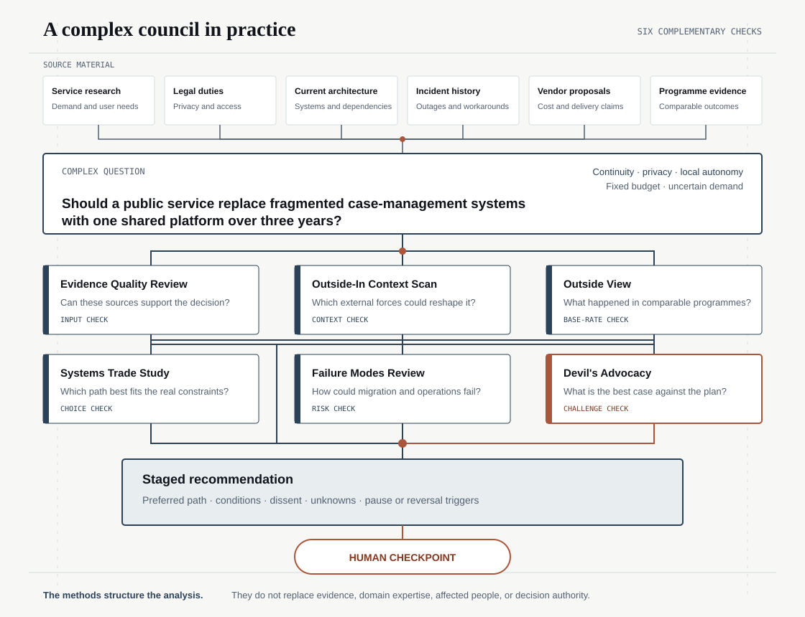

<p align="center">
  
</p>

<h1 align="center">Method Council</h1>

<p align="center">
  <strong>Give an AI more than one way to examine hard or complex questions and problems.</strong>
  <br>
  Evidence, assumptions, alternatives, and risks are checked separately and
  brought together in one report.
</p>

<p align="center">
  <a href="https://github.com/jremick/method-council/actions/workflows/ci.yml"></a>
  <a href="LICENSE"></a>
</p>


## Quick start

The tested setup uses Codex with a ChatGPT subscription. Install
[Git](https://git-scm.com/) and [uv](https://docs.astral.sh/uv/), then run:

```bash
git clone https://github.com/jremick/method-council.git
cd method-council
uv sync --frozen --all-groups
uv run --frozen method-council validate
```

Open the cloned folder in Codex. The included
[Method Council skill](skill/method-council/SKILL.md) will be available as
`$method-council`.

For example:

```text
Use $method-council to review this decision:

[your question]

Evidence and context:
[your files, links, constraints, and options]

Choose the smallest useful set of methods. Keep facts, assumptions, unknowns,
and disagreements separate. Tell me what evidence would change the answer.
```

You can also ask for a specific kind of help:

- “Investigate why this happened without settling on the first explanation.”
- “Compare these options and show which assumptions could change the choice.”
- “Stress-test this conclusion and show the strongest case against it.”
- “Explore plausible futures and tell me what signs to watch.”
- “Clarify what ‘safe enough’ means here and test the edge cases.”
- “Show which values and affected people this design may be overlooking.”

The checkout keeps the skill, method catalogue, and validation tools together.
A standalone packaged install is not available yet. The method files are
model-neutral, but other AI providers have not received the same testing.

## What Method Council is

A normal AI answer can move too quickly from information to a conclusion.
Method Council asks the AI to run a few documented analysis methods separately,
then combine their findings without hiding disagreement or missing evidence.

The “members” are methods, not characters or simulated experts. Separate
methods provide different checks. They do not turn one model into several
independent minds.

## The method families

Method Council has 24 optional methods in five families. A family is simply the
kind of question a method mainly helps answer. Most councils need only two to
four complementary methods.

| Family | What it helps you ask | Optional methods and their value |
| --- | --- | --- |
| **Analytical** | What do the evidence, explanations, uncertainty, and risks support? | <ul><li>Evidence Quality — check sources</li><li>Key Assumptions — find load-bearing beliefs</li><li>Competing Hypotheses — compare explanations</li><li>Devil's Advocacy — challenge the lead answer</li><li>Alternative Futures — explore plausible paths</li><li>Indicators and Signposts — know what to watch</li><li>Failure Modes — find possible failures</li><li>Causal Factors — explain an observed outcome</li><li>Outside View — use comparable cases</li><li>Outside-In — scan wider forces</li></ul> |
| **Interpretive** | What do the important terms, passages, and contexts mean? | <ul><li>Concept Clarification — separate and test meanings</li><li>Contextual Interpretation — compare source-bound readings</li><li>Reflexive Thematic Analysis — find patterns across qualitative evidence</li><li>Speech-Act Analysis — examine what language does in context</li></ul> |
| **Normative** | Which principles and judgments should guide the choice? | <ul><li>Reflective Equilibrium — reconcile judgments and principles</li><li>Rights and Proportionality — test limits on rights or important interests</li><li>Capability and Distribution — compare people's real opportunities</li></ul> |
| **Pragmatic** | What changes in practice, and which option best serves the goal? | <ul><li>Pragmatic Clarification — test practical differences</li><li>Systems Trade Study — compare options and trade-offs</li><li>Theory of Change — map how an intervention is expected to work</li><li>Adaptive Management — learn and adjust through monitored cycles</li></ul> |
| **Participatory** | Whose values and experience need real evidence or involvement? | <ul><li>Value-Sensitive Inquiry — connect stakeholder evidence, values, and design</li><li>Human-Centred Design Inquiry — ground design in evidence from real users</li><li>Structured Expert Elicitation — gather real expert judgment over repeated rounds</li></ul> |

The newer interpretive, normative, pragmatic, and participatory methods widen
the council beyond mainly factual and logical analysis. They also have strict
limits: an AI cannot decide moral truth, invent stakeholder views, or turn one
plausible interpretation into the only correct reading. All methods without a
recorded specimen remain unevaluated previews. See the
[method catalogue review](docs/METHOD_CATALOGUE.md) for the reasoning, sources,
and remaining gaps.

## How it works

1. **Scope the question.** Define the decision, evidence, constraints, and who
   will make the final call.
2. **Choose the methods.** Unless you name them, the skill proposes the smallest
   complementary set that fits the task and explains why. You can override the
   proposal with specific methods.
3. **Run separate passes.** Each method produces its own findings and keeps
   evidence, assumptions, and unknowns visible.
4. **Challenge the emerging answer.** A challenge method looks for weaknesses,
   counterevidence, and credible alternatives.
5. **Combine the results.** The final report shows the answer, disagreements,
   limitations, next actions, and what would change the judgment.


A larger problem can draw on more kinds of source material and use methods that
check the evidence, external context, comparable cases, trade-offs, failure
paths, and the emerging recommendation.



A values-heavy question might ask: **What should “fair access” mean for an
automated public service, and which design should follow from it?** Source
material could include the policy definition, legal duties, service data,
appeals, and actual stakeholder research. A possible council is Concept
Clarification, Value-Sensitive Inquiry, Reflective Equilibrium, and Devil's
Advocacy. If the stakeholder evidence is missing, the council must say so and
remain incomplete rather than inventing people's views.

The methods are the council members. Models are optional execution paths.

- **Easy default:** one GPT runs each method in Codex. These passes are marked
  `CORRELATED` because they may share the same model blind spots.
- **Preferred when available:** assign passes to different supported provider
  models. Useful disagreement can expose model-specific blind spots, but it is
  still not independent proof or a vote for the truth.

External providers are never called automatically. They must be supported by
the current host and explicitly authorised. If a provider fails, the run stays
`ERROR` or `INCOMPLETE`; Method Council does not replace it with a simulated
answer.

The software checks that the expected steps and evidence links are present. It
cannot prove that a conclusion is true or that the method was used expertly.

Today, automatic selection is a model proposal followed by deterministic route
checks. A structured [automatic method advisor](docs/METHOD_ADVISOR.md) is
planned as the eventual default, but it will not be treated as trusted until it
passes separate selection evaluations.

## What the result means

Every run has a clear status:

- `PASS` — the required method work is present and passes its checks.
- `INCOMPLETE` — evidence or required work is missing, stale, or unavailable.
- `FAIL` — a hard check has a proven failure.
- `ERROR` — required execution or parsing did not complete.

`PASS` means the method contract was completed. It does not mean the answer is
correct. Same-model or same-host passes are marked `CORRELATED`, because they
are not independent confirmation.

## Current status

Method Council is a public alpha:

- The Codex path uses an existing ChatGPT subscription and has five recorded,
  commit-bound acceptance runs.
- Those runs pass the structural and host-evidence checks, while honestly
  remaining `INCOMPLETE / CORRELATED`.
- Eight of the 24 methods have an initial specimen and a correlated semantic
  screen. The other 16 are explicitly unevaluated.
- No method has yet passed the planned blinded baseline comparison and
  independent practitioner review.
- Claude and Gemini adapter contracts exist only as disabled previews.

Use it for experiments, reviews, and learning. Do not treat it as the sole
authority for a high-stakes decision.

## Learn more

- [Method catalogue review](docs/METHOD_CATALOGUE.md) — selection reasoning,
  current coverage, and remaining gaps
- [Automatic method advisor plan](docs/METHOD_ADVISOR.md) — default selection,
  user overrides, safeguards, and evaluation gates
- [Method guides](methods/) — the steps, uses, and limits of each method
- [Report anatomy](docs/REPORT_ANATOMY.md) — what a finished report contains
- [Method evaluation](evals/METHOD_EVALS.md) — what has and has not been tested
- [Confidence plan](evals/CONFIDENCE_PLAN.md) — the next blinded evaluations
- [Source register](docs/SOURCES.md) — where the methods came from
- [Codex workflow](docs/CODEX_WORKFLOW.md) — the tested subscription path
- [Architecture](docs/ARCHITECTURE.md) — contracts and trust boundaries

## Contributing, security, and license

Small, focused contributions are welcome. Start with
[CONTRIBUTING.md](CONTRIBUTING.md). Report security problems privately as
described in [SECURITY.md](SECURITY.md), not in a public issue.

Method Council is licensed under the [Apache License 2.0](LICENSE). Source and
attribution details are recorded in [THIRD_PARTY_NOTICES.md](THIRD_PARTY_NOTICES.md)
and the [source register](docs/SOURCES.md). Citations do not imply endorsement
by the cited organisations.
