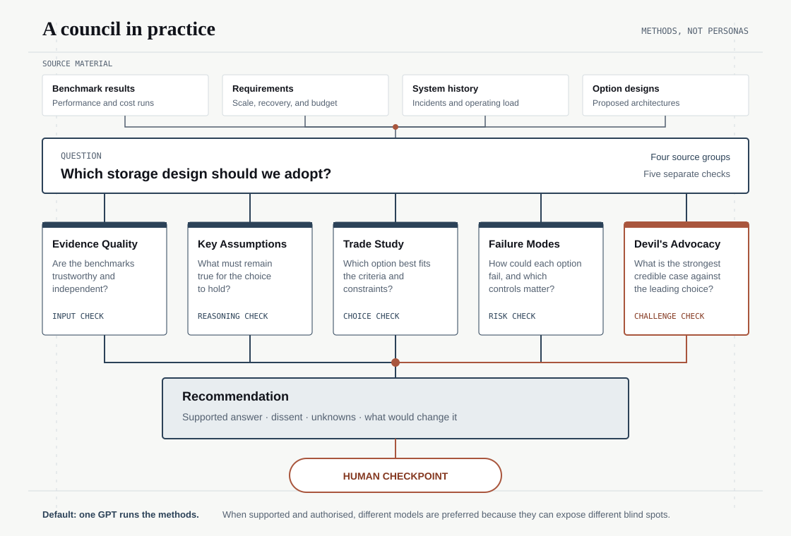

<p align="center">
  
</p>

<h1 align="center">Method Council</h1>

<p align="center">
  <strong>Give an AI more than one way to examine a hard question.</strong>
  <br>
  Evidence, assumptions, alternatives, and risks are checked separately and
  brought together in one report.
</p>

<p align="center">
  <a href="https://github.com/jremick/method-council/actions/workflows/ci.yml"></a>
  <a href="LICENSE"></a>
  
</p>

> **Public alpha:** ready to try and inspect, but not yet proven to improve
> decisions. Codex with GPT is the tested path. Other model adapters are still
> disabled previews.


## Quick start

Open this repository in Codex, or give another AI access to the
[GitHub repository](https://github.com/jremick/method-council). Then ask it to
use Method Council on your question.

For example:

```text
Read the Method Council repository and use it to review this decision:

[your question]

Evidence and context:
[your files, links, constraints, and options]

Choose the smallest useful set of methods. Keep facts, assumptions, unknowns,
and disagreements separate. Tell me what evidence would change the answer.
```

You can also ask for a specific kind of help:

- “Investigate why this happened without settling on the first explanation.”
- “Compare these options and show which assumptions could change the choice.”
- “Stress-test this conclusion and show the strongest case against it.”
- “Explore plausible futures and tell me what signs to watch.”

The repository already includes a Method Council skill for Codex. The method
files are model-neutral, so another capable AI can read and follow them, but
those paths have not yet received the same testing.

## What Method Council is

A normal AI answer can move too quickly from information to a conclusion.
Method Council asks the AI to run a few documented analysis methods separately,
then combine their findings without hiding disagreement or missing evidence.

The “members” are methods, not characters or simulated experts. Separate
methods provide different checks. They do not turn one model into several
independent minds.

## The methods

| Method | What it helps you do |
| --- | --- |
| **Evidence Quality Review** | Check whether the available information is credible, current, independent, and sufficient. |
| **Key Assumptions Check** | Find the beliefs holding an answer up and show what changes if they are wrong. |
| **Competing Hypotheses Analysis** | Compare several explanations against the same evidence instead of choosing a favourite too early. |
| **Devil's Advocacy** | Build the strongest credible case against the leading conclusion and record what survives. |
| **Alternative Futures Analysis** | Explore several plausible ways a situation could develop without pretending to predict one future. |
| **Indicators and Signposts** | Decide what to watch and when new evidence should trigger a review. |
| **Systems Trade Study** | Compare options against clear criteria, constraints, uncertainty, and trade-offs. |
| **Failure Modes Review** | Find how parts of a system could fail, what the effects would be, and which controls need checking. |
| **Causal Factors Analysis** | Explain an observed failure from timeline and contributing conditions through corrective action. |
| **Outside View / Reference Class Check** | Test a plan or estimate against what happened in comparable completed cases. |
| **Outside-In Context Scan** | Find material external forces before a question becomes too narrowly framed. |

The first eight cover input quality, assumptions, explanations, challenge,
uncertainty, monitoring, choice, and prospective failure. The three new preview
methods add retrospective causes, real-world base rates, and wider context.
That gives the catalogue a useful range without adding methods that mainly
repeat the same job. See the [method catalogue review](docs/METHOD_CATALOGUE.md)
for the selection reasoning and remaining gaps.

## How it works

1. **Scope the question.** Define the decision, evidence, constraints, and who
   will make the final call.
2. **Choose the methods.** Use the smallest complementary set that fits the
   task and the amount of rigor needed.
3. **Run separate passes.** Each method produces its own findings and keeps
   evidence, assumptions, and unknowns visible.
4. **Challenge the emerging answer.** A challenge method looks for weaknesses,
   counterevidence, and credible alternatives.
5. **Combine the results.** The final report shows the answer, disagreements,
   limitations, next actions, and what would change the judgment.



The methods are the council members. Models are optional execution paths.

- **Easy default:** one GPT runs each method in Codex. These passes are marked
  `CORRELATED` because they may share the same model blind spots.
- **Preferred when available:** assign passes to different supported provider
  models. Useful disagreement can expose model-specific blind spots, but it is
  still not independent proof or a vote for the truth.

External providers are never called automatically. They must be supported by
the current host and explicitly authorised. If a provider fails, the run stays
`ERROR` or `INCOMPLETE`; Method Council does not replace it with a simulated
answer.

The software checks that the expected steps and evidence links are present. It
cannot prove that a conclusion is true or that the method was used expertly.

## What the result means

Every run has a clear status:

- `PASS` — the required method work is present and passes its checks.
- `INCOMPLETE` — evidence or required work is missing, stale, or unavailable.
- `FAIL` — a hard check has a proven failure.
- `ERROR` — required execution or parsing did not complete.

`PASS` means the method contract was completed. It does not mean the answer is
correct. Same-model or same-host passes are marked `CORRELATED`, because they
are not independent confirmation.

## Current status

Method Council is a public alpha:

- The Codex path uses an existing ChatGPT subscription and has five recorded,
  commit-bound acceptance runs.
- Those runs pass the structural and host-evidence checks, while honestly
  remaining `INCOMPLETE / CORRELATED`.
- Eight of the eleven methods have an initial specimen and a correlated
  semantic screen. The three new methods are explicitly unevaluated.
- No method has yet passed the planned blinded baseline comparison and
  independent practitioner review.
- Claude and Gemini adapter contracts exist only as disabled previews.

Use it for experiments, reviews, and learning. Do not treat it as the sole
authority for a high-stakes decision.

## Learn more

- [Method catalogue review](docs/METHOD_CATALOGUE.md) — selection reasoning,
  current coverage, and remaining gaps
- [Method guides](methods/) — the steps, uses, and limits of each method
- [Report anatomy](docs/REPORT_ANATOMY.md) — what a finished report contains
- [Method evaluation](evals/METHOD_EVALS.md) — what has and has not been tested
- [Confidence plan](evals/CONFIDENCE_PLAN.md) — the next blinded evaluations
- [Source register](docs/SOURCES.md) — where the methods came from
- [Codex workflow](docs/CODEX_WORKFLOW.md) — the tested subscription path
- [Architecture](docs/ARCHITECTURE.md) — contracts and trust boundaries

## Contributing, security, and license

Small, focused contributions are welcome. Start with
[CONTRIBUTING.md](CONTRIBUTING.md). Report security problems privately as
described in [SECURITY.md](SECURITY.md), not in a public issue.

Method Council is licensed under the [Apache License 2.0](LICENSE). Source and
attribution details are recorded in [THIRD_PARTY_NOTICES.md](THIRD_PARTY_NOTICES.md)
and the [source register](docs/SOURCES.md). Citations do not imply endorsement
by the cited organisations.
