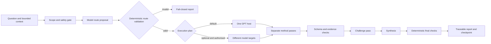

# Architecture

## Summary

Method Council is a host-neutral methodology protocol with a Codex-first
interaction surface. The model proposes and applies semantic methods;
deterministic code validates route, structure, evidence, status, and release
gates.

## Components

1. **Canonical catalog** — versioned method and profile records.
2. **Schemas** — structural contracts for definitions and run artifacts.
3. **Deterministic core** — semantic validation, routing policy, evidence
   binding, aggregation, and release verification.
4. **Codex skill** — progressive-disclosure instructions and bounded subagent
   workflow for a ChatGPT-subscription user.
5. **Provider adapters** — optional translations behind capability probes.
6. **Evaluation harness** — representative, adversarial, and failure fixtures.
7. **Evidence bundle** — content-bound reports used for later release decisions.

## Data flow

## Trust boundaries

- User prompts and supplied context are untrusted data.
- Retrieved sources and repository files may contain prompt injection.
- Method-pass output is untrusted until schema and semantic checks pass.
- Adapters cannot mark their own output verified.
- Only the deterministic core derives the primary run status.
- External provider and write capabilities are deny-by-default.
- A multi-model plan records assignments but does not itself grant provider
  access, prove authentication, or launch external calls.

## Failure behavior

- Unknown method, invalid route, or unsupported rigor: reject before launch.
- Missing/invalid method artifact: `ERROR` or `INCOMPLETE`; never simulate it.
- Provider capability not proven: `unverified` or `unavailable`.
- Same-model passes: retain `CORRELATED` side condition.
- Assigned model/provider unavailable: retain `ERROR` or `INCOMPLETE`; do not
  silently substitute the coordinator model.
- Missing evidence: findings remain assumptions/unknowns and the report cannot
  pass an evidence-completeness gate.
- Synthesis disagreement: retain both conclusions and the discriminating
  evidence needed to resolve them.

## Alternatives considered

- **Prompt-only skill:** fastest initially, but cannot enforce critical
  contracts and drifts across hosts.
- **Standalone orchestration service:** stronger runtime control, but adds auth,
  hosting, cost, and privacy surfaces before product value is proven.
- **Chosen hybrid:** native host orchestration plus a small local deterministic
  core. It preserves the subscription-first UX while keeping hard gates in
  code.

## Observability

Public alpha will use local structured run metadata only. It records method,
version, host/provider state, observable model ID, status, side conditions,
timestamps, artifact digests, and validation reasons. Raw prompts, hidden
reasoning, secrets, and unrelated context are not retained by default.
