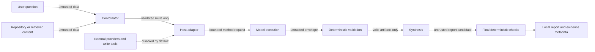

# Threat model

Version: 0.1.0

Status: Wave 1 baseline; runtime enforcement remains incomplete

## Threat model summary

Method Council coordinates model-generated analysis over user questions,
repository content, and optional retrieved evidence. All of those inputs, plus
adapter and model output, are untrusted. The main security objective is to keep
untrusted content from changing coordinator policy, causing unauthorized side
effects, disclosing local data, laundering invalid work into PASS, or creating
unsupported authority claims.

The initial product is a local Codex-subscription workflow with external
provider calls and write capabilities disabled by default. Codex authentication
is owned by the host, not stored or implemented by this repository. Optional
provider adapters expand the trust surface and cannot be described as available
until an explicit capability check succeeds.

The deterministic core, not a model or adapter, owns route validity, structural
and semantic validation, evidence binding, status precedence, and release
eligibility. This boundary limits model authority; it does not make model output
safe or correct.

## Assets and security properties

| Asset | Required property |
|---|---|
| User and repository data | Read only within the approved scope; no default raw-prompt persistence |
| Credentials and host authentication | Never requested, printed, committed, or copied by project code |
| Coordinator and method contracts | Cannot be overridden by untrusted task or evidence content |
| Run and report integrity | Only validated, evidence-bound method results can influence status |
| Method provenance | Source claims and project adaptations remain distinguishable |
| Local filesystem | No path escape or write side effect without explicit authorization |
| Provider state | Installed binary, claimed model ID, authentication, and successful execution remain distinct |
| Release evidence | Content-bound, reproducible, and unable to authorize publication by itself |

## Actors and entry points

- A legitimate user may accidentally supply secrets, private paths, or
  over-broad instructions.
- Repository authors or retrieved sources may include indirect prompt
  injection or misleading provenance.
- A model may emit malformed, fabricated, overconfident, or policy-changing
  output without malicious intent.
- A malicious contributor may attempt to weaken schemas, fixtures, checks,
  dependency integrity, or public-release claims.
- A provider, adapter, local executable, or dependency may be unavailable,
  compromised, misconfigured, or falsely detected as healthy.

## Trust boundaries

The boundaries are:

1. untrusted task/evidence entering the coordinator;
2. canonical route data entering a host adapter;
3. model output returning to deterministic validation;
4. a report candidate crossing the final status/evidence gate;
5. any optional external provider, network, credential, or write capability.

## Abuse cases, controls, and residual risk

| ID | Severity | Abuse case | Required control | Wave 1 evidence | Residual risk |
|---|---:|---|---|---|---|
| TM-01 | High | Indirect prompt injection in a task, repository file, or retrieved source asks the model to ignore contracts, expose hidden material, or perform a side effect. | Treat content as quoted data; keep coordinator policy outside evidence; deny side effects by default; validate the returned envelope. | Offline `hostile-prompt-injection` fixture plus recorded live `hostile-review` run | One successful hostile run does not prove general prompt-injection resistance or runtime isolation. |
| TM-02 | High | A method result or synthesis supplies its own PASS flag, invents evidence, or omits a failed pass. | Recompute status with `FAIL > ERROR > INCOMPLETE > PASS`; bind findings to run evidence IDs; reject missing or malformed results; retain all gate reasons. | Fixture validator plus malformed-provider, missing-evidence, and unsupported-claim cases | The deterministic core and evidence-digest verifier are being implemented in another lane and need integration tests. |
| TM-03 | High | Secrets, raw prompts, local paths, or unrelated context leak into reports, diagnostics, commits, or provider requests. | Do not persist raw prompts by default; never request hidden chain-of-thought; redact diagnostics; scope inputs; scan tracked files before release. | Privacy fields in every fixture; `tracked_file_hygiene.py` | The helper does not scan Git history, untracked/ignored files, most binaries, or provider/host logs. Dedicated secret scanning is still required. |
| TM-04 | High | A model or injected instruction invokes network, shell, GitHub, or filesystem mutations outside the authorized task. | External calls and tool side effects are deny-by-default; adapters expose only declared capabilities; user authorization gates mutations; validate paths and arguments deterministically. | Frozen contracts and offline-only fixture helpers | A skill is not an operating-system sandbox. Host configuration and future adapters require separate enforcement and testing. |
| TM-05 | High | A crafted path, symlink, or artifact name escapes the run or fixture directory. | Reject traversal and symlink escape; resolve paths under an explicit root; use temporary directories for tests and generated intermediates. | Fixture inventory rejects path traversal; hygiene scan reports tracked symlink escape | Runtime artifact writers and clean-install code require dedicated path tests. |
| TM-06 | Medium | A provider is reported available because its executable exists, even though authentication or execution fails. | Keep presence, auth, submission, response parsing, and validated completion separate; use `verified`, `preview`, `unverified`, `unavailable`, or `degraded`; never simulate a missing result. | `provider-degraded-malformed` fixture and four ChatGPT-authenticated Codex executions | Claude and Gemini capability probes and real runs remain absent. |
| TM-07 | Medium | A method or README claims official, certified, standard, de facto, or intelligence-grade status without exact source support. | Require source basis, adaptation, and claim limits; validate semantic provenance before routing; prefer “adapted from.” | `unsupported-official-standard-claim` fixture | Human source interpretation and method fidelity still need independent expert review. |
| TM-08 | Medium | Several passes on one host/model are presented as independent corroboration or converted into a confidence vote. | Track method, provider, model, and source diversity separately; mark same-host/model work `CORRELATED`; preserve dissent instead of weighted voting. | Architecture, debugging, risk, and split fixtures | Observable model identifiers may be incomplete; correlated failure modes cannot be fully measured in v1. |
| TM-09 | Medium | Large input, recursive delegation, retries, or provider stalls cause resource exhaustion. | Enforce rigor method-count limits, bounded concurrency, input/artifact size limits, timeouts, and retry budgets; fail visibly. | Fixture route limits and a bounded acceptance-runner timeout | Artifact-size limits and provider-specific cancellation/retry behavior remain unverified. |
| TM-10 | Medium | A compromised dependency, action, installer, or generated adapter changes behavior. | Minimize dependencies; lock and review them; pin CI actions by immutable digest; separate generated from canonical files; verify clean installs. | Minimal standard-library helpers | Lockfile, CI hardening, dependency review, provenance attestations, and clean-clone proof are pending. |
| TM-11 | Medium | Model-generated Markdown, links, or structured fields trigger unsafe rendering or command execution downstream. | Treat report fields as data; escape renderers; never execute report text; reject unexpected schema fields and unsafe locators. | Strict fixture envelopes | Renderers and downstream integrations are not part of the Wave 1 vertical slice. |
| TM-12 | Low | Local telemetry becomes surveillance or retains sensitive semantic content. | Record only bounded operational metadata and digests by default; make any recording explicit, local, redacted, and inspectable. | Persistence contract and fixture privacy invariants | Even metadata can be sensitive when combined; retention and deletion UX is not yet designed. |

## Authentication and permissions

- The default Codex path relies on the user’s existing host-managed ChatGPT
  authentication. Project code must not read, export, or duplicate that state.
- Optional provider credentials are out of scope for Wave 1. Future adapters
  must use their documented host authentication path and must not add a second
  credential store merely because a token is unavailable.
- Read access does not imply write access. Repository changes, remote pushes,
  releases, GitHub settings, and visibility changes require their own explicit
  authorization.
- Provider diversity does not grant evidence independence or broader data
  access. Each adapter receives only its declared bounded inputs.

## Data retention and hidden reasoning

Default persisted run data is limited to method and schema versions, host and
provider state, observable model identifiers when available, primary status,
side conditions, timestamps, reason codes, artifact digests, and bounded
validation errors.

The default workflow does **not** persist raw prompts or full context. It does
not request, expose, or store hidden chain-of-thought. Methods should return the
reviewable artifact needed by their contract: findings classified as fact,
inference, assumption, or unknown; evidence references; alternatives;
confidence basis; change conditions; and errors. A concise rationale is an
auditable result field, not a request for private internal reasoning.

Any future recording mode must be explicit, local-first, bounded, redacted,
and separately tested. Its design and retention policy are not authorized by
this baseline.

## Implemented controls versus open gates

Implemented through Waves 1–3:

- eight structured public-safe positive, adversarial, and failure fixtures;
- standard-library fixture inventory and deterministic status validation;
- an offline tracked-file hygiene helper that reports paths/categories only;
- regression tests proving status precedence and non-disclosure of matched
  secret-like values;
- fail-closed run preparation and read-back verification with forged-status,
  digest, route, evidence, execution, correlation, and finding-reference tests;
- four recorded ChatGPT-authenticated Codex runs with no raw prompt/event
  persistence, including a hostile embedded-instruction case;
- disabled-by-default preview adapters for Claude Code and Gemini CLI;
- this documented threat model and residual-risk register.

Still required before public alpha:

- clean-clone install and temporary-target tests;
- dedicated secret and Git-history scanning;
- locked dependency and immutable CI-action review;
- independent security, methodology-fidelity, and public-readiness acceptance;
- live GitHub readback for visibility, rules, security reporting, and secret
  protection settings.

## Security references

- [OWASP LLM Prompt Injection Prevention Cheat Sheet](https://cheatsheetseries.owasp.org/cheatsheets/LLM_Prompt_Injection_Prevention_Cheat_Sheet.html)
- [NIST Secure Software Development Framework, SP 800-218](https://csrc.nist.gov/pubs/sp/800/218/final)
- [GitHub secret scanning documentation](https://docs.github.com/code-security/secret-scanning/about-secret-scanning)
- [SLSA threat model](https://slsa.dev/spec/v1.0/threats-overview)

These sources inform controls; their inclusion does not certify this project or
prove conformance.
